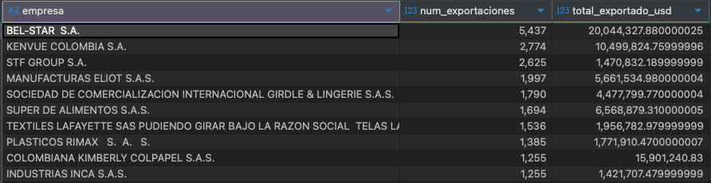
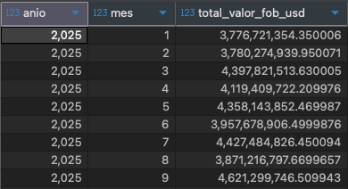
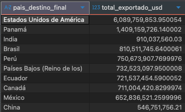
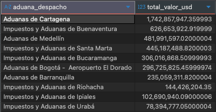
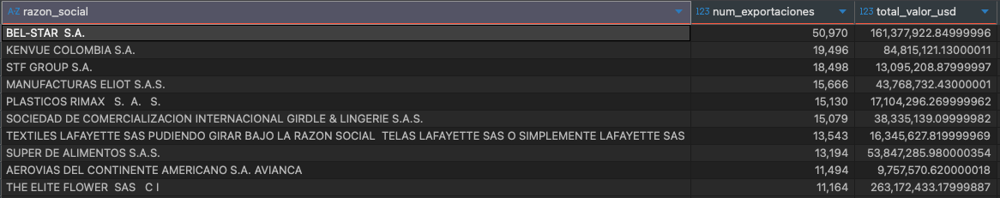
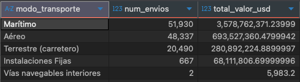

# Data Warehouse de Exportaciones Colombianas (DIAN)

Este proyecto implementa un **Data Warehouse** para el análisis de las exportaciones colombianas, utilizando los datos abiertos proporcionados por la **DIAN (Dirección de Impuestos y Aduanas Nacionales)**.  
El objetivo principal es consolidar, limpiar y estructurar los datos de exportaciones mensuales para facilitar la exploración analítica y la toma de decisiones mediante consultas SQL y visualizaciones.

## Modelo de Datos

El modelo se basa en un esquema **estrella (Star Schema)**, compuesto por una **tabla de hechos** principal y **seis dimensiones**: tiempo, empresa, transporte, aduanas, destino y modalidad

### Esquema del Data Warehouse

**Tablas:**
- **fact_exportaciones**: Contiene los indicadores cuantitativos del proceso exportador.
- **dim_time**: Representa la dimensión temporal (día, mes, año).
- **dim_empresa**: Información de los exportadores (NIT, razón social, ubicación).
- **dim_transporte**: Modo de transporte utilizado.
- **dim_aduanas**: Aduanas de despacho y salida.
- **dim_destino**: País y ciudad de destino de las exportaciones.
- **dim_modalidad**: Tipo o modalidad de exportación.

## Proceso ETL

El flujo ETL fue desarrollado en **Python (Pandas + SQLAlchemy)**:

1. **Extracción**  
   - Lectura de los archivos mensuales provistos por la DIAN
   - Consolidación de registros históricos

2. **Transformación**  
   - Limpieza y normalización de datos
   - Creación de claves primarias y foráneas
   - Generación de las dimensiones
   - Información geográfica (latitud y longitud) utilizando el dataset [worldcities](https://simplemaps.com/data/world-cities)

3. **Carga (Load)**  
   - Inserción de los datos en una base **PostgreSQL local** utilizando `SQLAlchemy`

## Arquitectura Propuesta en la Nube (Producción)

La arquitectura propuesta está en **AWS** tomando en cuenta los costos, enfocándose en almacenamiento en S3 e implementando activación de eventos mediante EventBridge

### Diagrama de Arquitectura

**Flujo de Proceso:**
1. **Amazon S3** – Almacenamiento de los archivos mensuales (zona *raw*)
2. **AWS Lambda** – Ejecución automática del proceso ETL (transformación y limpieza)
3. **Amazon S3 (Curated)** – Almacenamiento de los datos procesados
4. **AWS Glue Catalog** – Administración del metadato y conexión con herramientas analíticas
5. **Amazon Redshift** – Consulta y análisis de los datos limpios
6. **Power BI / QuickSight** – Visualización y exploración de métricas clave

## Consultas Analíticas

> **Empresas con mayor volumen exportado en el último mes**

> **Valor total (FOB) de exportaciones mes a mes**

> **Destinos más frecuentes en los últimos seis meses**

> **Top 10 aduanas en el último mes**

> **Modos de transporte más utilizados**

> **Distribución geográfica de exportaciones**

